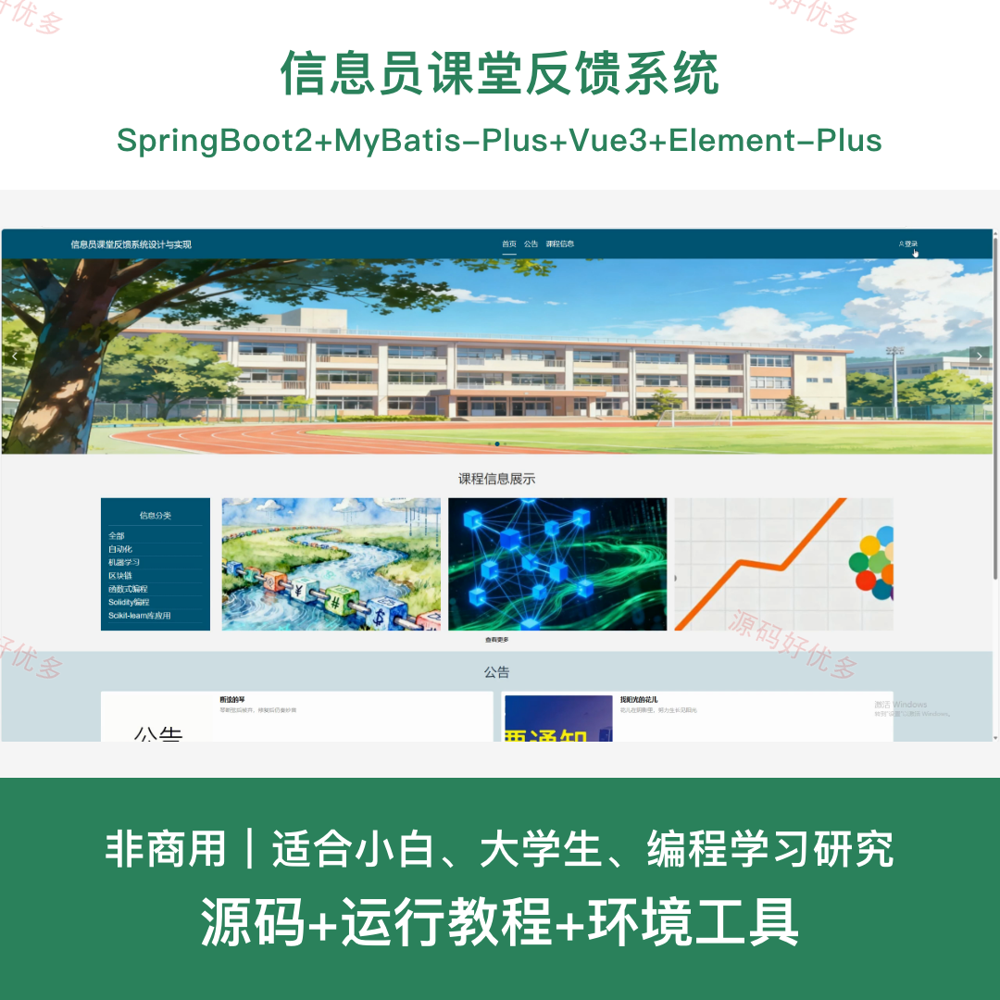
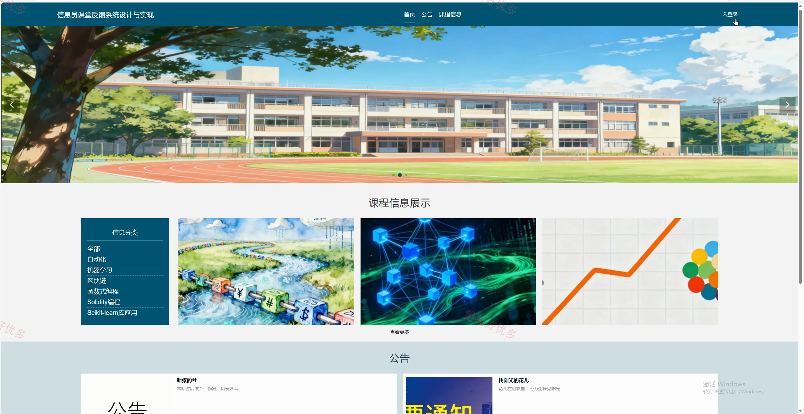
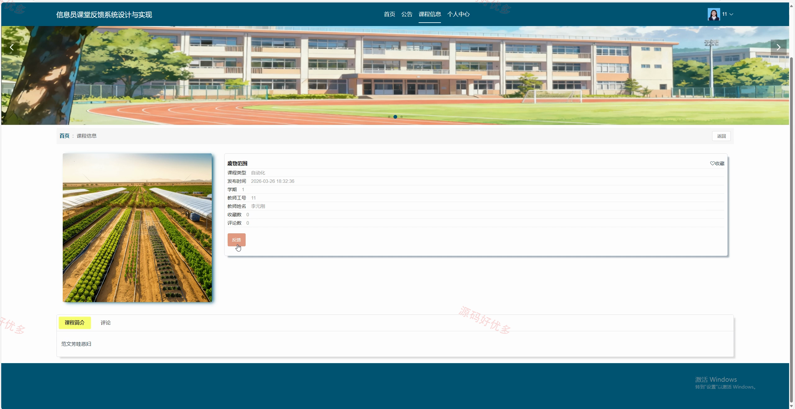
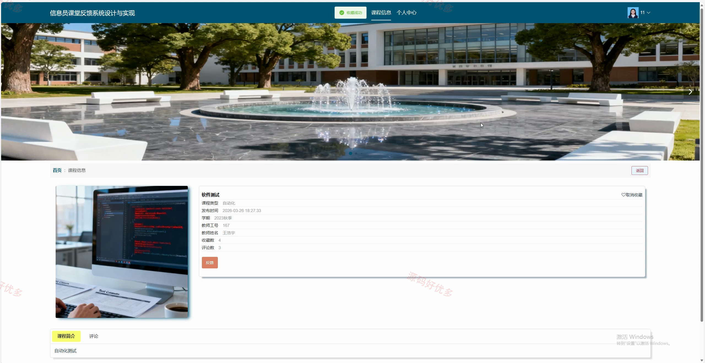
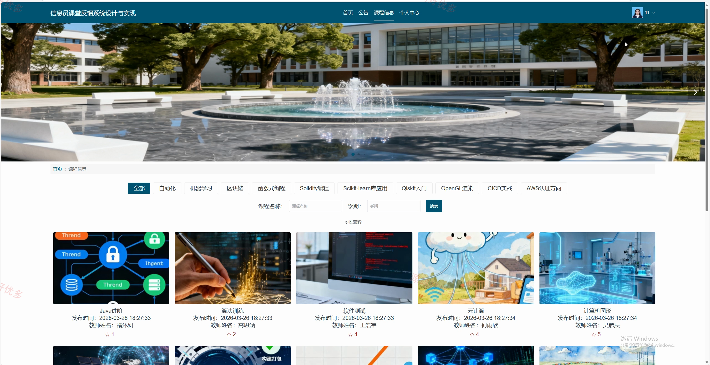
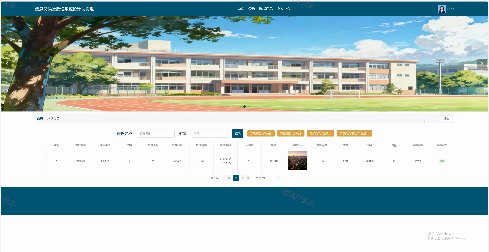
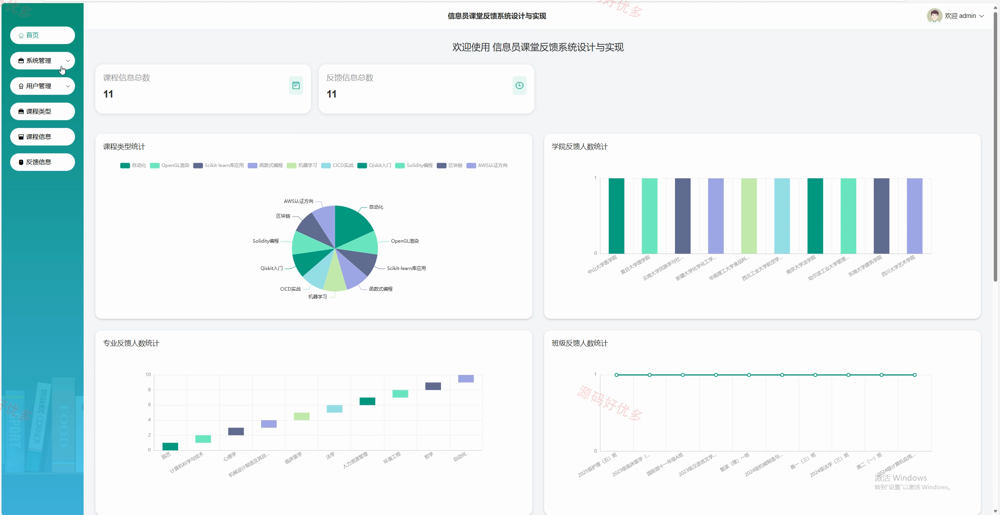
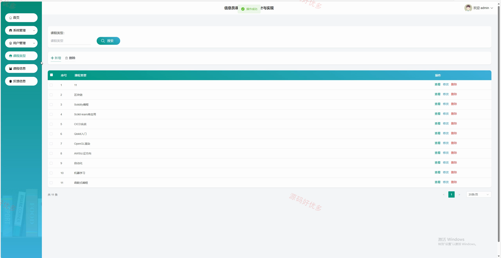
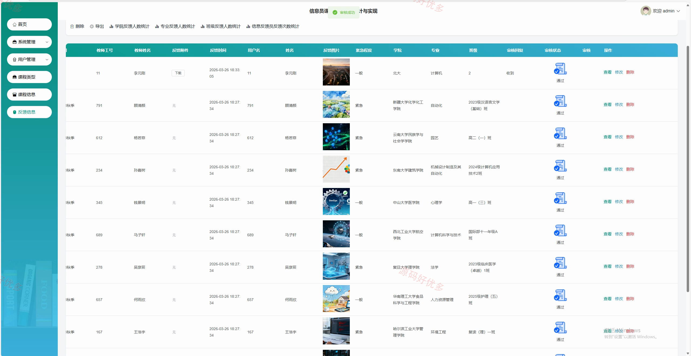

## 源码问题查看主页咨询

### 一、关键词
信息员课堂反馈系统、信息员课堂反馈、信息员课堂反馈信息管理、信息员课堂反馈后台管理

### 二、作品包含
源码+数据库+全套环境和工具资源+本地部署教程

### 三、项目技术
前端技术： Html、Css、Js、Vue3.5、Element-Plus
后端技术：Java、SpringBoot2.2.2、MyBatis-Plus

### 四、运行环境（以下版本亲测，其他版本兼容性请自行测试）
开发工具：IDEA/eclipse + VSCODE

数据库：MySQL5.7+（共13张表）

数据库管理工具：Navicat10以上版本

环境配置软件： JDK1.8 + Maven3.6.3

前端Nodejs：16+

浏览器：谷歌浏览器

### 五、项目介绍
项目编号：springbootA659D

信息员课堂反馈系统面向信息员、教师、管理员，提供公告查看、课程信息查看、课程信息反馈、我的收藏管理、反馈信息管理、个人中心维护、课程信息评价等功能，实现各角色在系统中的实际业务协作。

角色：信息员、教师、管理员

信息员功能：前台登录与注册、公告查看、课程信息查看、课程反馈提交、课程评价与收藏、我的收藏管理、反馈信息查看及下载、个人中心维护。

教师功能：前台登录注册及个人中心、公告查看、课程信息查看及管理、课程评价收藏及评论查看、课程类型统计、反馈信息管理、学院专业班级反馈统计、反馈信息导出及下载。

管理员功能：后台登录、轮播图与菜单管理、公告与日志管理、信息员与教师管理、管理员管理、课程类型管理、课程信息管理、反馈信息管理。

### 六、运行截图

